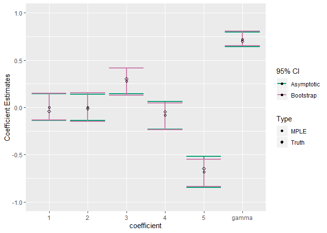
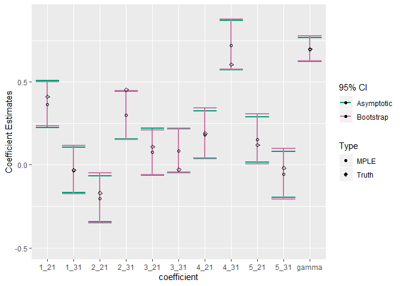

Automultinomial
================
Stephen Berg
2019-10-23

This intro explains the installation and use of the R package
**automultinomial**. The **automultinomial** package is designed to be
used for regressions similar to logistic or multinomial logit
regression. However, unlike ordinary logistic and multinomial logit
models, the autologistic/automultinomial model includes an
autocorrelation parameter to account for spatial dependence between
observations.

The organization of this document is:

1.  cran and Github installation how-to
2.  A data example with binary response (2 response categories)
3.  A data example with 3 response categories

# The problem **automultinomial** solves

Consider a data problem where covariates (the independent variables) and
categorical outcomes (the dependent variables) are observed on a spatial
grid or lattice. If the outcomes are spatially autocorrelated, then our
coefficient estimates and inference procedures ought to take this into
account. Intuitively, when outcomes are correlated, the effective sample
size of the dataset is smaller than if the outcomes were independent.
The statistical information we can gain based on samples from multiple
nearby sites may be less than if we were able to sample sites that are
\`\`more independent’’.

A particular practical risk in neglecting spatial correlation is that
confidence intervals may be too narrow. We might find \`\`statistically
significant’’ relationships that are in fact byproducts of noise or
dependent sampling. The **automultinomial** package provides a tool for
dealing with outcomes with spatial autocorrelation. It still might
happen that nearby sites in a dataset are effectively independent. But
we can only assess this using a method that accounts for the spatial
arrangement of the samples.

The vignette on cran contains a technical description of the model being
fit.

# Installation

### cran installation

``` r
install.packages("automultinomial")
library(automultinomial)
```

### Github installation

``` r
install.packages("devtools")
```

Then, run the following:

``` r
devtools::install_github(repo="stephenberg/automultinomial")
library(automultinomial)
```

# Data example 1: K=2 response categories

Here, we will demonstrate how to simulate data using
**automultinomial**, how to fit data using **automultinomial**, and how
to analyze the output.

### Simulating data

First we will use the **drawSamples()** function to simulate some data
from the autologistic model. The **drawSamples()** function takes the
following arguments:

  - **beta**: the \(p\times 1\) coefficient vector (for \(K=2\) response
    categories) or the \(p\times (K-1)\) coefficient matrix (for \(K>2\)
    response categories)
  - **gamma**: the value of the correlation parameter
  - **X**: the \(n\times p\) design matrix \(X=[x_1,x_2,...,x_n]^T\)
  - **A**: a square symmetric adjacency matrix encoding the neighborhood
    structure
  - **burnIn**: the number of burnin iterations for the Gibbs sampler.
    Safe to leave at the default of 300.
  - **nSamples**: the number of simulated samples to draw.

First, we will set up the simulation parameters:

``` r
library(automultinomial)
set.seed(33)

#10 predictors
p=5


#n times n grid
n=40

#make grid and adjacency matrix
latticeGraph=igraph::make_lattice(c(n,n))
A=igraph::get.adjacency(latticeGraph)

#set coefficient values 
beta=matrix(rnorm(p),ncol=1)*0.3
beta
```

    ##             [,1]
    ## [1,] -0.04077736
    ## [2,] -0.01223909
    ## [3,]  0.30316170
    ## [4,] -0.04747873
    ## [5,] -0.64699125

``` r
#set covariate values
X=matrix(rnorm(n^2*p),ncol=p)

#set the correlation parameter value (0.7 is a moderate amount of spatial correlation)
gamma=0.7
```

Then, we will use the **drawSamples()** function to generate simulated
data.

``` r
#use drawSamples to simulate data with parameters beta and gamma by Gibbs sampling
y=drawSamples(beta,gamma,X,A,nSamples = 1)
```

``` r
y2=drawSamples(beta,0,X,A,nSamples = 1)
```

The figure shows plots of the responses on the grid. On the left plot,
we can see “clumping” of the responses due to the positive
autocorrelation parameter \(\gamma=0.7\). The right hand plot is from
the distribution with the same \(\boldsymbol{\beta}\), and \(\gamma=0\).

### Fitting an autologistic model to the data (K=2 categories)

Now we’ll fit an autologistic model using the **MPLE()** function. The
**MPLE()** function takes 3 primary arguments:

  - **X**: the design matrix \(X=[x_1,x_2,...,x_n]^T\)
  - **A**: a square symmetric adjacency matrix encoding the neighborhood
    structure
  - **y**: the response vector \(y\), which is required by **MPLE()** to
    be a factor vector.

There are also several secondary arguments.

  - **ciLevel**: for \(xy\)% confidence intervals, set **ciLevel** to
    \(0.xy\) (the default is **ciLevel**=0.95, which produces 95%
    confidence intervals)
  - **method**: By choosing **method**=“asymptotic”, MPLE will output
    confidence intervals based on the asymptotic distribution of the
    pseudolikelihood estimator. For bootstrap confidence intervals, use
    **method**=“boot”. The default is **method**=“asymptotic”.
  - **burnIn**: the number of burnin iterations for the Gibbs sampler
    for **method**=“boot”. Safe to leave at the default of 300.
  - **nBoot**: the number of bootstrap samples to use for making
    bootstrap confidence intervals.

After fitting the model, we will examine confidence intervals for the
fitted parameters. The asymptotic type confidence intervals can be
computed very quickly, but may be less accurate in practice than
bootstrap confidence intervals.

First, we will fit the model using the **MPLE()** function.

``` r
# responses must be input as a factor
y=factor(y)
fit1=MPLE(X=X,y=y,A=A,ciLevel = 0.95,method = "asymptotic")
fit2=MPLE(X=X,y=y,A=A,ciLevel = 0.95,method = "boot",nBoot = 500)
```

Then, we can use the **MPLE\_summary()** function to view the model
summary in table form.

``` r
#to see the information contained in fit1 and fit2, use str() (not run to save space)
#str(fit1)
#str(fit2)

fitSummary1=MPLE_summary(fit1)
```

    ## 
    ## 
    ## Table: Summary with confidence intervals
    ## 
    ##      2 vs. 1                  gamma               
    ## ---  -----------------------  --------------------
    ## 1    0.001 (-0.139,0.141)     0.718 (0.641,0.795) 
    ## 2    -0.002 (-0.141,0.136)                        
    ## 3    0.277 (0.142,0.413)                          
    ## 4    -0.085 (-0.231,0.061)                        
    ## 5    -0.686 (-0.851,-0.521)                       
    ## 
    ## 
    ## Table: Summary with p-values
    ## 
    ##      2 vs. 1          gamma     
    ## ---  ---------------  ----------
    ## 1    0.001 (0.989)    0.718 (0) 
    ## 2    -0.002 (0.975)             
    ## 3    0.277 (0)                  
    ## 4    -0.085 (0.255)             
    ## 5    -0.686 (0)

``` r
fitSummary2=MPLE_summary(fit2)
```

    ## 
    ## 
    ## Table: Summary with confidence intervals
    ## 
    ##      2 vs. 1                 gamma               
    ## ---  ----------------------  --------------------
    ## 1    0.001 (-0.136,0.15)     0.718 (0.651,0.805) 
    ## 2    -0.002 (-0.152,0.155)                       
    ## 3    0.277 (0.13,0.414)                          
    ## 4    -0.085 (-0.236,0.048)                       
    ## 5    -0.686 (-0.836,-0.55)                       
    ## 
    ## 
    ## Table: Summary with p-values
    ## 
    ##      2 vs. 1          gamma     
    ## ---  ---------------  ----------
    ## 1    0.001 (0.988)    0.718 (0) 
    ## 2    -0.002 (0.972)             
    ## 3    0.277 (0)                  
    ## 4    -0.085 (0.25)              
    ## 5    -0.686 (0)

<!-- -->

# Data example 2: K=3 response categories

Now, we demonstrate the use of the package when there are 3 response
categories. Essentially, everything is still the same, and most of the
previous code doesn’t change at all. The only difference is that now,
the \(\boldsymbol{\beta}\) parameter is a matrix with \(2=K-1\) columns,
rather than a vector as in the \(K=2\) case.

### Simulating data

Generating simulated data using the function **drawSamples()**.

``` r
set.seed(42)

#10 predictors
p=5

#n times n grid
n=40

#make grid and adjacency matrix
latticeGraph=igraph::make_lattice(c(n,n))
A=igraph::get.adjacency(latticeGraph)

#set coefficient values 
#with 3 categories in the response, beta is now a matrix
beta=matrix(rnorm(p*2),ncol=2)*0.3
beta
```

    ##            [,1]        [,2]
    ## [1,]  0.4112875 -0.03183735
    ## [2,] -0.1694095  0.45345660
    ## [3,]  0.1089385 -0.02839771
    ## [4,]  0.1898588  0.60552711
    ## [5,]  0.1212805 -0.01881423

``` r
#set covariate values
X=matrix(rnorm(n^2*p),ncol=p)

#set the correlation parameter value (0.7 is a moderate amount of spatial correlation)
gamma=0.7
```

``` r
#use drawSamples to simulate data with parameters beta and gamma by Gibbs sampling
y=drawSamples(beta,gamma,X,A,nSamples = 1)
```

``` r
y2=drawSamples(beta,0,X,A,nSamples = 1)
```

Figure  shows plots of the 3-category responses on the grid. On the left
plot, we again see “clumping” of the responses due to the positive
autocorrelation parameter. The right hand plot is from the distribution
with the same \(\boldsymbol{\beta}\), and \(\gamma=0\).

### Fitting an automultinomial model to the data (K=3 categories)

``` r
#responses must be input as a factor
y=factor(y)
fit1=MPLE(X=X,y=y,A=A,ciLevel = 0.95,method = "asymptotic")
fit2=MPLE(X=X,y=y,A=A,ciLevel = 0.95,method = "boot",nBoot = 500)
```

``` r
#to see the information contained in fit1 and fit2, use str() (not run to save space)
#str(fit1)
#str(fit2)

fitSummary1=MPLE_summary(fit1)
```

    ## 
    ## 
    ## Table: Summary with confidence intervals
    ## 
    ##      2 vs. 1                  3 vs. 1                 gamma               
    ## ---  -----------------------  ----------------------  --------------------
    ## 1    0.366 (0.224,0.509)      -0.032 (-0.169,0.106)   0.696 (0.624,0.769) 
    ## 2    -0.204 (-0.343,-0.065)   0.301 (0.158,0.444)                         
    ## 3    0.079 (-0.064,0.221)     0.085 (-0.047,0.217)                        
    ## 4    0.181 (0.038,0.324)      0.722 (0.573,0.871)                         
    ## 5    0.153 (0.014,0.291)      -0.056 (-0.195,0.082)                       
    ## 
    ## 
    ## Table: Summary with p-values
    ## 
    ##      2 vs. 1          3 vs. 1          gamma     
    ## ---  ---------------  ---------------  ----------
    ## 1    0.366 (0)        -0.032 (0.65)    0.696 (0) 
    ## 2    -0.204 (0.004)   0.301 (0)                  
    ## 3    0.079 (0.278)    0.085 (0.206)              
    ## 4    0.181 (0.013)    0.722 (0)                  
    ## 5    0.153 (0.03)     -0.056 (0.424)

``` r
fitSummary2=MPLE_summary(fit2)
```

    ## 
    ## 
    ## Table: Summary with confidence intervals
    ## 
    ##      2 vs. 1                  3 vs. 1                 gamma               
    ## ---  -----------------------  ----------------------  --------------------
    ## 1    0.366 (0.234,0.502)      -0.032 (-0.175,0.116)   0.696 (0.628,0.778) 
    ## 2    -0.204 (-0.352,-0.049)   0.301 (0.154,0.448)                         
    ## 3    0.079 (-0.061,0.212)     0.085 (-0.05,0.222)                         
    ## 4    0.181 (0.042,0.343)      0.722 (0.576,0.878)                         
    ## 5    0.153 (0.004,0.309)      -0.056 (-0.206,0.098)                       
    ## 
    ## 
    ## Table: Summary with p-values
    ## 
    ##      2 vs. 1          3 vs. 1          gamma     
    ## ---  ---------------  ---------------  ----------
    ## 1    0.366 (0)        -0.032 (0.694)   0.696 (0) 
    ## 2    -0.204 (0.004)   0.301 (0)                  
    ## 3    0.079 (0.3)      0.085 (0.246)              
    ## 4    0.181 (0.024)    0.722 (0)                  
    ## 5    0.153 (0.054)    -0.056 (0.434)

<!-- -->
